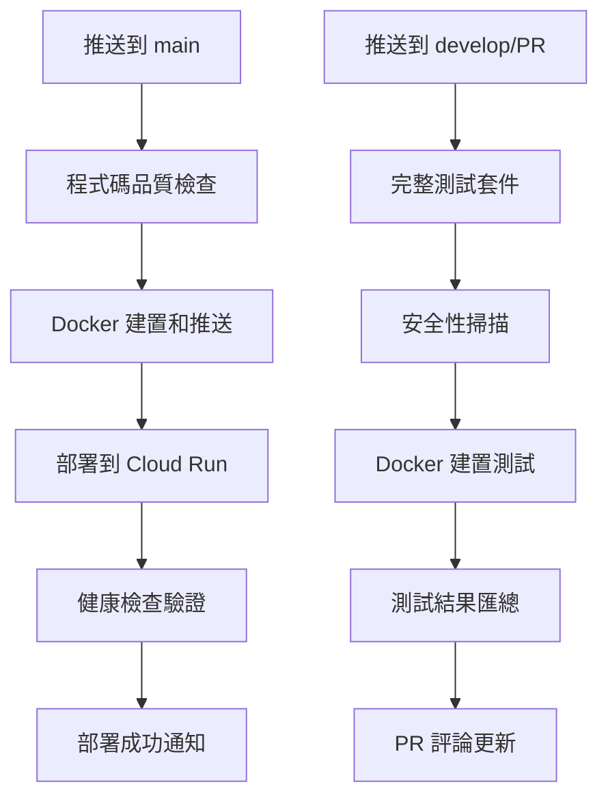

# GitHub Actions CI/CD Workflows

## 📋 Workflow 概覽

### 🚀 `deploy.yml` - 生產部署
**觸發條件**: 推送到 `main` 分支或手動觸發

**流程**:
1. **程式碼品質檢查** - TypeScript, ESLint, 測試
2. **Docker 建置和推送** - 建置映像並推送到 Docker Hub
3. **Cloud Run 部署** - 部署到 Google Cloud Run
4. **部署驗證** - 健康檢查驗證
5. **通知** - 成功/失敗通知

### 🧪 `test.yml` - 測試和驗證
**觸發條件**: 推送到 `develop` 分支、PR 到 `main`/`develop` 或手動觸發

**流程**:
1. **程式碼品質檢查** - 完整測試套件
2. **安全性掃描** - 漏洞檢查
3. **Docker 建置測試** - 驗證 Docker 建置
4. **測試結果匯總** - 生成測試報告
5. **PR 自動評論** - 在 PR 中顯示測試結果

## 🔧 所需 GitHub Secrets

```
DOCKER_USERNAME         # Docker Hub 用戶名
DOCKER_PASSWORD         # Docker Hub 密碼或 Access Token
GCP_PROJECT_ID          # Google Cloud 專案 ID
GCP_SA_KEY             # Google Cloud 服務帳戶 JSON 金鑰
CLOUD_RUN_REGION       # Cloud Run 部署區域
CLOUD_RUN_SERVICE      # Cloud Run 服務名稱
```

## 🔧 所需 GitHub Variables

```
DOCKER_IMAGE           # Docker 映像名稱
NODE_VERSION          # Node.js 版本
```

## 🎯 工作流程觸發

### 自動觸發
- **main 分支推送** → 自動部署到生產環境
- **develop 分支推送** → 執行完整測試套件
- **Pull Request** → 執行測試並在 PR 中顯示結果

### 手動觸發
兩個 workflow 都支援手動觸發：
1. 前往 GitHub Actions 頁面
2. 選擇對應的 workflow
3. 點擊 "Run workflow"

## 📊 部署流程圖



## 🔍 監控和除錯

### 檢查部署狀態
```bash
# 檢查 Cloud Run 服務狀態
gcloud run services describe personal-finance-manager \
  --region=asia-east1 \
  --project=money-flow-468508

# 檢查服務日誌
gcloud logs tail --service=personal-finance-manager \
  --project=money-flow-468508
```

### GitHub Actions 日誌
- 前往 GitHub Actions 頁面檢視詳細日誌
- 每個 job 都有獨立的日誌
- 失敗時會自動保留構建產物供除錯

### 常見問題排解

#### Docker 建置失敗
- 檢查 Docker Hub 認證
- 確認 Dockerfile 路徑正確
- 檢查專案依賴安裝

#### Cloud Run 部署失敗
- 檢查 GCP 服務帳戶權限
- 確認 Secret Manager 設定
- 檢查 Cloud Run YAML 配置

#### 健康檢查失敗
- 確認應用程式正常啟動
- 檢查 MongoDB 連接
- 驗證環境變數設定

## 🚀 首次部署

1. **推送程式碼到 main 分支**:
   ```bash
   git push origin main
   ```

2. **監控 GitHub Actions**:
   - 前往專案的 Actions 頁面
   - 觀察 "🚀 Deploy to Production" workflow

3. **驗證部署**:
   - 等待 workflow 完成
   - 檢查提供的服務 URL
   - 測試健康檢查端點

## 📈 最佳實踐

### 開發流程
1. 在 `develop` 分支開發新功能
2. 建立 PR 到 `main` 分支
3. 檢查自動測試結果
4. 合併 PR 後自動部署

### 版本管理
- 使用有意義的 commit 訊息
- 為重要版本建立 tag
- 在 PR 中描述變更內容

### 安全性
- 定期檢查依賴更新
- 監控安全性掃描結果
- 及時修復漏洞

---

🎉 **恭喜！** 您的 CI/CD 流程已經建立完成，現在可以享受全自動化的部署體驗！