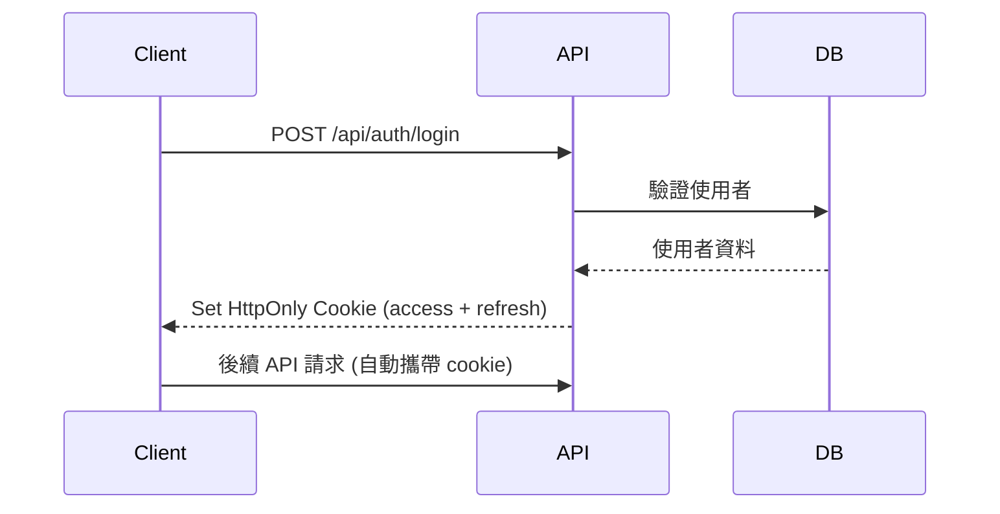
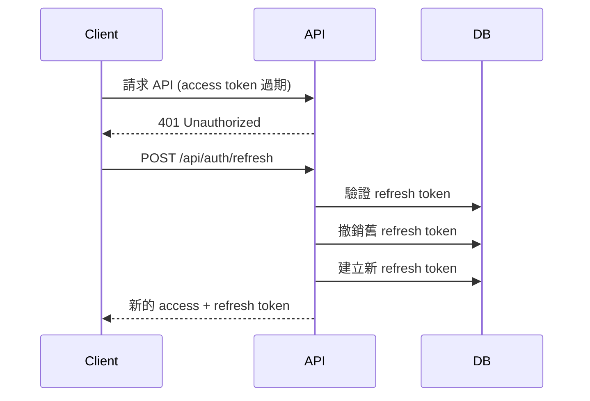
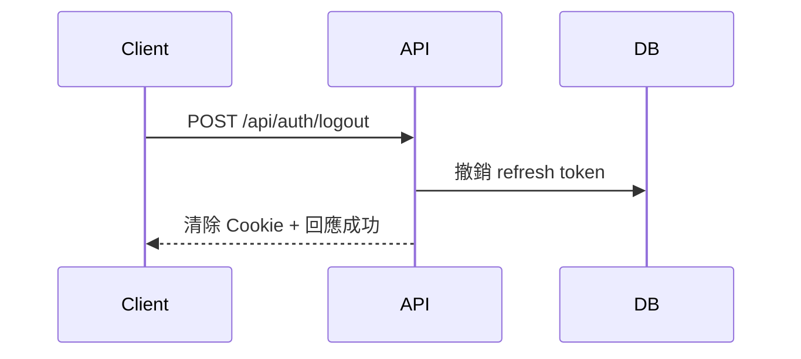

# 認證系統設計文檔

## 📋 概覽

Personal Finance Manager 的認證系統採用 JWT (JSON Web Token) 機制，並結合雙 Token 策略和 HttpOnly Cookie 儲存，確保最高等級的安全性。

## 🏗️ 系統架構

### 核心組件
```
lib/
├── auth/
│   ├── jwt.ts           # JWT 工具模組
│   ├── password.ts      # 密碼處理模組
│   └── validation.ts    # 認證相關驗證
├── models/
│   └── user.ts         # 使用者模型（已存在）
server/
├── middleware/
│   ├── auth.ts         # 認證中間件
│   └── rateLimit.ts    # 頻率限制中間件
└── api/auth/
    ├── register.post.ts # 註冊 API
    ├── login.post.ts    # 登入 API
    ├── logout.post.ts   # 登出 API
    ├── refresh.post.ts  # Token 刷新 API
    ├── me.get.ts        # 使用者資訊 API
    ├── forgot-password.post.ts
    ├── reset-password.post.ts
    ├── change-password.post.ts
    ├── send-verification.post.ts
    └── verify-email.post.ts
```

## 🔐 Token 策略設計

### 雙 Token 架構

#### Access Token
- **用途**: 日常 API 存取驗證
- **有效期**: 15 分鐘
- **儲存方式**: HttpOnly Cookie (主要) + localStorage (備用)
- **內容**: 使用者 ID、角色、權限等基本資訊

#### Refresh Token
- **用途**: 刷新 Access Token
- **有效期**: 7 天
- **儲存方式**: HttpOnly Cookie (僅此方式)
- **安全特性**: 使用後輪換 (RTR - Refresh Token Rotation)

### Token 儲存策略

#### 主要方案：HttpOnly Cookie
```typescript
// Cookie 設定範例
const cookieOptions = {
  httpOnly: true,           // 防止 XSS 攻擊
  secure: true,             // 僅 HTTPS 傳輸
  sameSite: 'lax',         // CSRF 保護
  maxAge: 15 * 60 * 1000,  // 15 分鐘 (Access Token)
  path: '/'
}
```

**優點**:
- 🛡️ 最高安全性，防止 XSS 攻擊
- 🔄 自動隨請求發送
- 🎯 可精確控制作用域和過期時間

**缺點**:
- 需要 CSRF 保護 (透過 SameSite 解決)
- 跨域設定較複雜

#### 備用方案：localStorage
```typescript
// 僅在特定情況下使用
if (needsFallbackStorage) {
  localStorage.setItem('access_token', token)
}
```

**使用場景**:
- 移動端 WebView 兼容性問題
- 開發環境跨域需求
- 特殊的第三方整合需求

## 🔄 Token 生命週期管理

### 1. 登入流程


### 2. Token 刷新流程 (RTR)


### 3. 登出流程


## 🛡️ 安全機制

### 1. 密碼安全
- **雜湊演算法**: bcrypt (cost factor: 12)
- **密碼強度要求**: 最少 8 字元，包含大小寫、數字、特殊字元
- **密碼歷史**: 防止重複使用最近 5 次密碼

### 2. 登入保護
- **頻率限制**: 同一 IP 每分鐘最多 5 次登入嘗試
- **帳號鎖定**: 連續 5 次失敗後鎖定 15 分鐘
- **異常偵測**: 記錄登入 IP 和時間，檢測異常活動

### 3. Token 安全
- **JWT 簽名**: 使用 HS256 演算法
- **Token 撤銷**: 支援主動撤銷機制
- **輪換機制**: Refresh Token 使用後即失效

### 4. 傳輸安全
- **HTTPS 強制**: 生產環境必須使用 HTTPS
- **HSTS 標頭**: 強制安全連線
- **CSRF 保護**: SameSite Cookie 屬性

## 📡 API 端點規格

### 認證相關 API
| 端點 | 方法 | 描述 | 認證要求 |
|------|------|------|----------|
| `/api/auth/register` | POST | 使用者註冊 | 無 |
| `/api/auth/login` | POST | 使用者登入 | 無 |
| `/api/auth/logout` | POST | 使用者登出 | 必須 |
| `/api/auth/refresh` | POST | 刷新 Token | Refresh Token |
| `/api/auth/me` | GET | 取得使用者資訊 | 必須 |

### 密碼管理 API
| 端點 | 方法 | 描述 | 認證要求 |
|------|------|------|----------|
| `/api/auth/forgot-password` | POST | 忘記密碼 | 無 |
| `/api/auth/reset-password` | POST | 重設密碼 | Reset Token |
| `/api/auth/change-password` | POST | 變更密碼 | 必須 |

### 郵件驗證 API
| 端點 | 方法 | 描述 | 認證要求 |
|------|------|------|----------|
| `/api/auth/send-verification` | POST | 發送驗證郵件 | 必須 |
| `/api/auth/verify-email` | POST | 驗證電子郵件 | Verify Token |

## 🔒 中間件系統

### 1. 認證中間件 (authMiddleware)
```typescript
// 使用方式
export default defineEventHandler(async (event) => {
  const user = await requireAuth(event)
  // API 邏輯...
})
```

### 2. 可選認證中間件 (optionalAuthMiddleware)
```typescript
// 使用方式
export default defineEventHandler(async (event) => {
  const user = await optionalAuth(event) // 可能為 null
  // API 邏輯...
})
```

### 3. 頻率限制中間件 (rateLimitMiddleware)
```typescript
// 設定範例
const loginRateLimit = rateLimit({
  windowMs: 60 * 1000,    // 1 分鐘
  max: 5,                 // 最多 5 次嘗試
  keyBy: (event) => getClientIP(event)
})
```

## 📱 前端整合

### 1. API 呼叫
```typescript
// 自動處理 token 的 API 客戶端
const apiClient = {
  async request(url: string, options = {}) {
    // Cookie 會自動隨請求發送
    const response = await fetch(url, {
      credentials: 'include',  // 包含 Cookie
      ...options
    })
    
    // 處理 401 錯誤，自動刷新 token
    if (response.status === 401) {
      await this.refreshToken()
      return this.request(url, options)
    }
    
    return response
  }
}
```

### 2. 狀態管理
```typescript
// Pinia store 範例
export const useAuthStore = defineStore('auth', {
  state: () => ({
    user: null,
    isAuthenticated: false,
    isLoading: false
  }),
  
  actions: {
    async login(credentials) {
      // 登入邏輯
    },
    
    async logout() {
      // 登出邏輯
    },
    
    async checkAuth() {
      // 檢查認證狀態
    }
  }
})
```

## 🧪 測試策略

### 1. 單元測試
- JWT 工具函數測試
- 密碼雜湊/驗證測試
- 中間件邏輯測試

### 2. 整合測試
- 註冊/登入流程測試
- Token 刷新機制測試
- 頻率限制測試

### 3. 安全測試
- 暴力破解攻擊測試
- XSS/CSRF 攻擊測試
- Token 洩漏場景測試

## 📊 監控與分析

### 1. 安全事件監控
- 異常登入嘗試
- Token 異常使用
- 頻率限制觸發

### 2. 使用者行為分析
- 登入頻率統計
- 密碼重設趨勢
- 多裝置使用情況

## 🔧 部署考量

### 1. 環境變數
```bash
# JWT 設定
JWT_SECRET=your-super-secret-key-at-least-32-characters
JWT_ACCESS_EXPIRES_IN=15m
JWT_REFRESH_EXPIRES_IN=7d

# 安全設定
BCRYPT_ROUNDS=12
MAX_LOGIN_ATTEMPTS=5
ACCOUNT_LOCKOUT_TIME=15m

# Cookie 設定
COOKIE_DOMAIN=yourdomain.com
COOKIE_SECURE=true
```

### 2. 資料庫索引
```javascript
// 必要的索引
db.users.createIndex({ "email": 1 }, { unique: true })
db.users.createIndex({ "security.lastLoginAt": -1 })
db.users.createIndex({ "security.passwordResetToken": 1 })
db.users.createIndex({ "security.emailVerificationToken": 1 })
```

## 🚨 安全檢核清單

### 開發階段
- [ ] 所有密碼都經過適當雜湊
- [ ] JWT 密鑰足夠複雜且安全儲存
- [ ] 實作頻率限制機制
- [ ] Cookie 設定安全屬性
- [ ] 輸入驗證完整實作

### 部署階段
- [ ] HTTPS 強制啟用
- [ ] 安全標頭設定 (HSTS, CSP 等)
- [ ] 生產環境密鑰輪換
- [ ] 監控系統設定完成
- [ ] 備份和災難恢復計畫

---

**最後更新**: 2024-08-10  
**版本**: 1.0.0  
**負責人**: 開發團隊